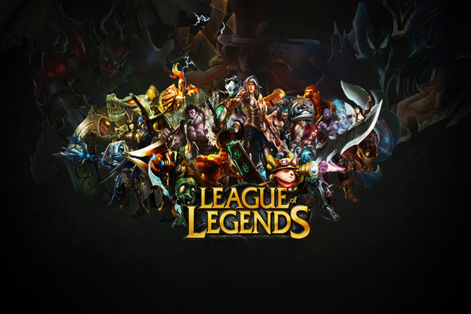
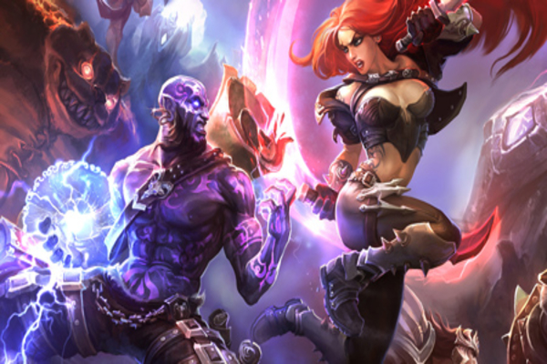
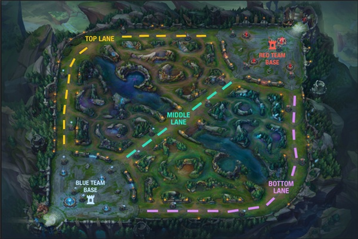
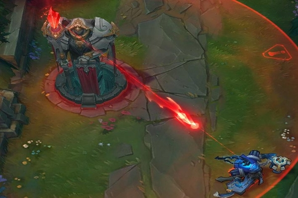
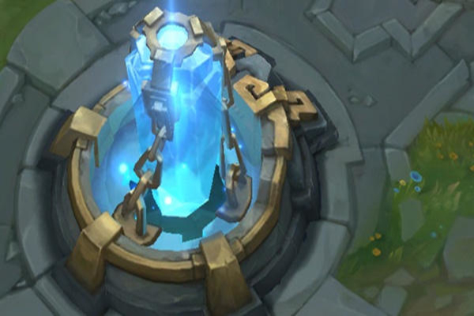
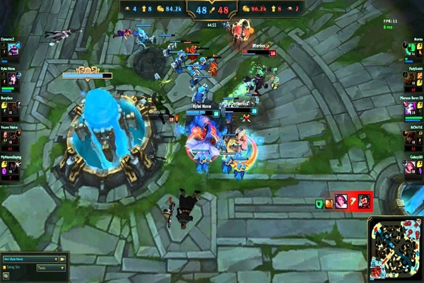

# League of Legends Analysis

## An Overview of League of Legends
League of Legends is a fast-paced, competitive online game that involves both offensive and defensive plays. Two teams of powerful champions, each with a unique design and playstyle, battle head-to-head across multiple battlefields and game modes. With an ever-expanding roster of champions, frequent updates and a thriving tournament scene, League of Legends offers endless replayability for players of every skill level. As of 2017, there are 119 million active online players every month spread across the world. League of Legends is also one of the largest eSports, with various annual tournaments taking place worldwide. In terms of eSports professional gaming as of June 2016, League of Legends has $29,203,916 USD in prize money, 4,083 Players, and 1,718 tournaments.  

## Our Objectives 
In this project, we use the dataset which has data for all the e-sports competitive League of Legends games from 2015 to 2017 to find different trends, and compare how different pro-players have performed at the competitive level. The goal is to learn how games are influenced, what champions are banned/played, and what matters most when it comes to winning the game.

## So what is League of Legends, and how does it work?
The objective of the game is simple - destroy the enemy nexus. In order to do this, champions must traverse down one of three different paths (or lanes) in order to attack their enemy at their weakest points they can exploit. Both teams have their lanes defended by numerous turrets; each turret grows in strength the closer it gets to its respective nexus and each turret must be eliminated in order to gain access to the next turret in that lane. Cooperating with fellow summoners is an absolute requirement for success, as it is easy for a champion to find themselves ambushed by enemies in the lanes of the Rift.  

## Champions
The League is filled with champions of every archetype, from devious masterminds to epic monsters and everything in between. Different champions suit different roles and strategies, so don't get discouraged if the first one you try doesn't mesh with your playstyle. [Here](https://na.leagueoflegends.com/en/game-info/champions/) is a link to all the 150 champions in the game with further description on each one. 

## Lanes and Roles 

### Top Lane
The Top laning champions can be classified as Tanks or Bruisers. A tank is the beefy dude who "tanks" or
"absorbs" all the damage from the enemy team so as to let his team's damage dealers stay at a safe distance and dish out damage. Bruisers are intermediates of a tank and fighter. They generally deal considerable damage but are not good at absorbing damage. Examples of tanks are Maokai, Nasus, and Shen. Examples of bruisers are Camille, Jax and Riven.

### Middle Lane
The Mid laning champions can be classified as Mages or Assassins. Mages typically deal loads damage to other champions and bring tons of utility with their kits. They are most often picked in the mid lane. Assassins on the other hand, cater to taking out a single target, their job is to assassinate. They are generally not picked in the professional scene and can be very niche picks. Examples of Mages are Syndra, Orianna, and Taliyah. Examples of Assassins are Zed, Talon and Ekko.

### The Jungle
The Jungle doesn't go to any "lane". Instead he wanders around in the spaces between maps, lurking to help out his laners by either ambushing the enemy champions, providing vision by placing wards and taking objectives such as barons and dragons.

### Bottom Lane
The Bottom lane is **THE** most important lane in the game. It usually has 2 people in it(from each team). The first is the ADC(Attack-Damage-Carry) and the second is his support. These 2 work hand-in-hand and deal the most damage in the game. However, they are very squishy and can be taken out quickly by assassins or such

 

## Turrets
Turrets are powerful defensive structures that defend each lane at even intervals, punishing enemies that come within range with deadly bolts of energy. Like minions, they prefer to attack targets other than you, unless you engage another champion while within range. A hostile turret will only target you if you're attacking an enemy champion or if you're the last target in range. Beware of picking a fight under an enemy turret.

## Inhibitors
   
  
Important structures known as inhibitors are located where each lane meets the base on both sides of the map. Destroying an inhibitor creates a powerful super minion each time a new minion wave spawns in that lane. Super minions are extremely durable, making them ideal for leading the charge on the enemy nexus. Inhibitors respawn after five minutes, so be sure to press your advantage during this time.

Destroying all three of an enemy's inhibitors will cause two super minions to spawn in each lane every time a new minion wave is created.

## The Nexus
 
At the heart of each base lies the nexus. Protected by two turrets, the nexus is the structure that periodically generates minion waves in each lane. Once a team has destroyed the enemy nexus, the game is over and that team is declared victorious.  

 